# Zotero Reference Management


---

> [!info] Before we start
> This is mostly a 'follow-along' or an interactive demonstration of using Zotero as a reference management software. Please feel free to ask questions during the demonstration so we can proceed together. I will try to answer to the best of my experience and knowledge.

---
# Introduction 🔬
- Researchers need efficient and <mark style="background: #BBFABBA6;">reliable</mark> reference management software to organize sources and generate citations.
- The software should be <mark style="background: #BBFABBA6;">easy</mark> to use, <mark style="background: #BBFABBA6;">compatible</mark> with various formats and platforms, and ideally <mark style="background: #BBFABBA6;">free</mark> or low-cost to accommodate tight budgets. 
- <mark style="background: #FFF3A3A6;">Zotero offers a comprehensive suite of features to meet these needs.</mark>


---
# Zotero Advantage 👍
1. 📄Zotero is free and open source, making it accessible to all users
2. 💪Integrate and Compatible with
	1. 🪟Operating systems: Windows, MacOS, Linux
	2. 🌐Web browsers: Chrome, Firefox, Safari
	3. 📖Word processors: Microsoft Word, LibreOffice, Google Docs
3. 🔎Automatically detect and save research materials from websites and databases
4. 🛠️Customise to fit individual needs with plugins and customization options
5. 🔐Don't need account for local use on personal computer if privacy is a concern
6. 🎁 *(Extra)* Integration with note taking tools like Obsidian.md

---
# Compare ⚖️
Other reference management tools like EndNote, Mendeley, and RefWorks also offer robust features but often come with limitations:

- 💰Cost: EndNote and RefWorks full featured require expensive subscription.
- 💁‍♂️Limited Integration: EndNote don't have web browser integration. Many don't support LibreOffice and Google Docs.
- 💬User Community, Support, and Customisation: Zotero’s open-source nature fosters a large, active user community that contributes to frequent updates and extensive support resources as well as variety of plugins to enhance Zotero functionalities.

---
# Platform and Software 🤝
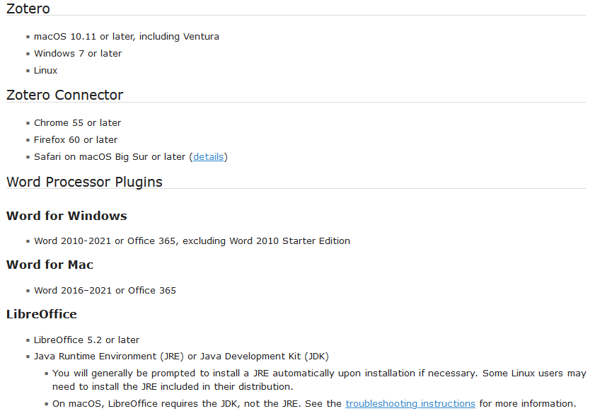

---
### About Me 🙇

> [!cite]Hi! 👋 I'm Alvin Alexander. I love Python🐍 and AI/ML so much that I ended up doing a CS research on applying GAN to satellite images. I have been using Zotero for the past two years for class assignments, personal curiosity, and research.


This presentation slides can be found at https://github.com/elvinado/Zotero-Sharing


---
#### Today's Agenda
## Part 1: Adding Items and Citation 🧺
1. ✅ Web integration with Zotero Connector
2. ✅ Collecting Sources
3. ✅ Microsoft Word Integration
4. ✅ Important notes about data management


---
#### Today's Agenda
## Part 2: Literature Management and Review 🗂️
1. ✅ Navigating Zotero
2. ✅ Essential Plugins for Zotero
3. ✅ Metadata
4. ✅ Annotating PDF within Zotero


---
#### Today's Agenda
#### (If time permits)
## Part 3: Extras ✨
Demonstration integration with Obsidian Note Taking tools


---
## Part 1
# Adding items and citation


---
##### Web Integration
## ⚙️Configure Connector Proxy
Proxy is needed on off-campus network.
- Go to Zotero Connector options > Proxies
-  Click ➕ and enter the following details:
	- Login URL Scheme: <mark style="background: #CACFD9A6;">```https://login.ezproxy.utm.my/login?qurl=%u```</mark>
	- Proxied URL Scheme: <mark style="background: #CACFD9A6;">```%h.ezproxy.utm.my/%p```</mark>
- Make sure ☑️<mark style="background: #ADCCFFA6;">_'Enable Proxy redirection'_</mark> and ☑️<mark style="background: #ADCCFFA6;">_'Automatic detect new proxies'_</mark> are checked. Disable when in on-campus network.

> [!attention] Try to restart Browser and Zotero after configuration. Sometimes the proxy don't redirect as expected.

---
##### Collecting Sources
## 🌐 Add item using web browser

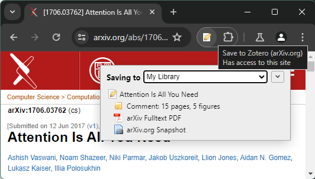

---
##### Collecting Sources
## 📄 Add item directly as PDF


- <mark style="background: #ADCCFFA6;">'Link to File...'</mark> to keep your file in your location
- <mark style="background: #ADCCFFA6;">'Store Copy of File...'</mark> to let Zotero manage the file

---
##### Collecting Sources
## 🆔 Add item using identifier 🥰
- 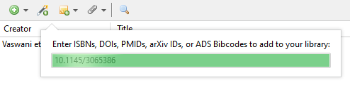
- Zotero uses Library of Congress, [WorldCat](http://www.worldcat.org/ "http://www.worldcat.org/"), and other catalogs for ISBNs, [CrossRef](http://www.crossref.org/ "http://www.crossref.org/") and other registries for DOIs, [NCBI PubMed](http://www.ncbi.nlm.nih.gov/pubmed/ "http://www.ncbi.nlm.nih.gov/pubmed/") for PubMed IDs, [arXiv.org](https://arxiv.org/ "https://arxiv.org/") for arXiv IDs, and [ADS](https://ui.adsabs.harvard.edu/ "https://ui.adsabs.harvard.edu/") for ADS Bibcodes.
- 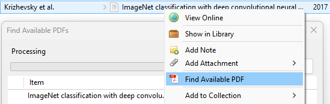
- Then, Zotero can find the corresponding PDF if its accessible.

---
##### Collecting Sources
## 📦 Add items in bulk

- Go to <mark style="background: #ADCCFFA6;">File</mark> > <mark style="background: #ADCCFFA6;">Import...</mark>
- 

---
##### Microsoft Word
## ⚙️Configure Citation Style for MS Word

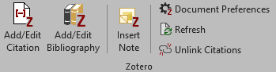
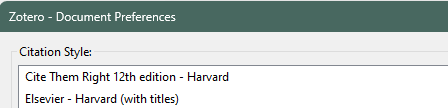

---
##### Microsoft Word
## 🗨️ Citing in MS Word


---
##### Microsoft Word
## 👂 Generate Bibliography in MS Word


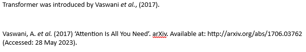


---
##### Data Management
## 🗃️ "Folder" system in Zotero
- 🏛️ Library - EVERYTHING!
- 🗃️ Collection - Virtual group for ideas
- 📚 Subcollection - Containing items
- 🧠 Smart Folders (i.e. Duplicate, Unfiled, Retracted)

> [!info] Collection and subcollection are essentially the same thing

---
##### Data Management
## 🗄️ Two ways files are stored
1. 🫠 You free save and name the files yourself wherever (known as <mark style="background: #BBFABBA6;">Linked Files</mark>)
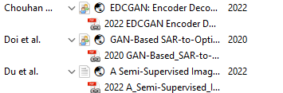

2. 🚶‍♂️ Leave it to Zotero to manage the files typically located in ```C:\Users\<user>\Zotero\storage\<item unique id>``` (known as <mark style="background: #BBFABBA6;">Stored Files</mark>)
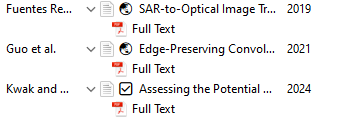

---
##### Data Management
## Conversion to Stored Files is possible
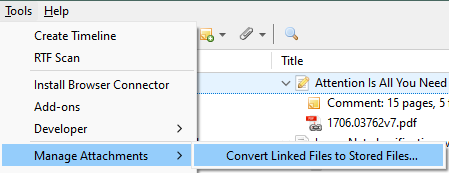

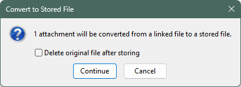
Stored files have the advantage of being able to sync to Zotero Cloud if you choose to.

---
##### Data Management
## 🔢Don't worry if you have many copies of items
- Duplicate Items in Collection pane can help deduplication
- Zotero intelligently knows they are duplicates
- You can decide which items to be the "base" item for merging

> [!warning] Although sometime you deliberately want to have copies if you review the same paper but for different projects


---
## Part 2
# Literature Management and Review


---
## 🖥️ Zotero Interface
- 📂 Collections Pane - "Folder"
- 📃 Item Pane - List of sources
- 🏷️ Tag Selector - To filter items within the "Folder"
- 📑 Metadata - Layout can be on the right or bottom
- 📁 Tab - Appears when PDF opened

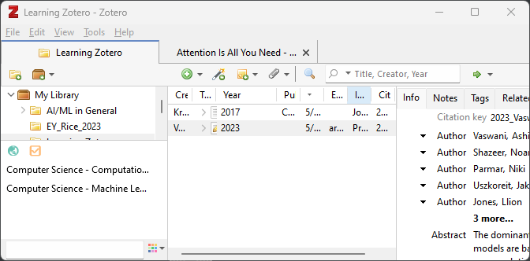

---
## 🔌 Essential Plugins

- Zutilo
	- Purpose: Extra menu items 
	- Link: https://github.com/wshanks/Zutilo/releases
- Better BibTeX
	- Purpose: Integration with other text-based toolchains
	- Link: https://github.com/retorquere/zotero-better-bibtex/releases

**Plugin Installation Steps**
1. Download .xpi from plugin website
2. Zotero main menu - Tools > Add-ons > Extensions
3. Click ⚙️ > Install Add-on From File…
4. Choose .xpi that you’ve just downloaded, click ‘Install’
---
## Item's Metadata
- 📄 Info
- 📝 Notes
- 🏷️ Tags
- 🔗 Related


---
## ✏️Annotating PDF within Zotero
- 🖌️ Multi Coloured Highlighter
- 📒 Multi Coloured Sticky Notes
- ⏹️ Multi Coloured Area Selection
- 📄 General Notes


---
# Thank you!


Reference: 
https://www.zotero.org/support/


---
## Part 3: Extra
# Demo
Integration with Obsidian Note Taking tools
